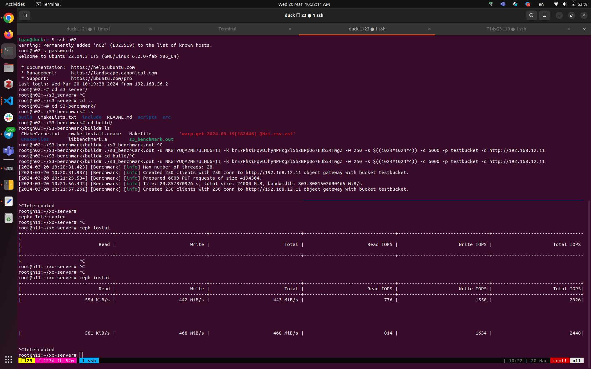
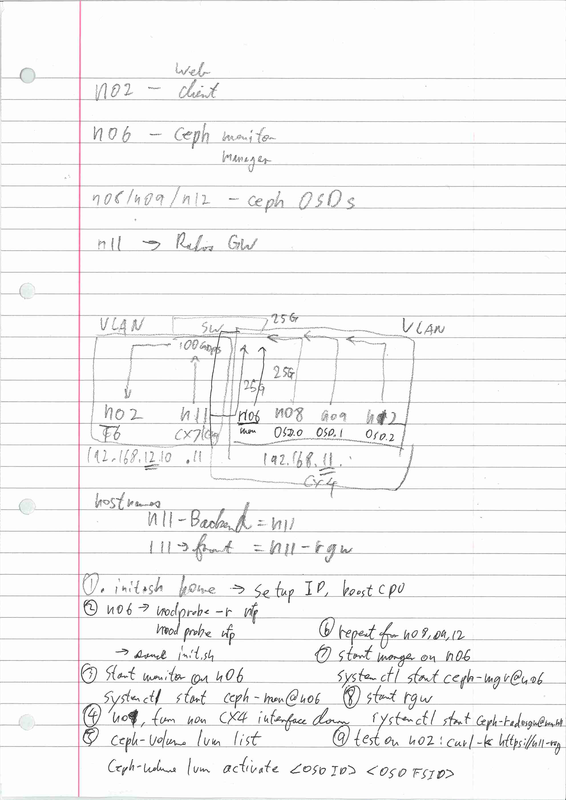

# Ceph boot

n06

```jsx
root@n06:~# modprobe -r nfp
root@n06:~# modprobe -v nfp
insmod /lib/modules/6.2.0-fab/kernel/net/tls/tls.ko
insmod /lib/modules/6.2.0-fab/updates/nfp.ko
root@n06:~# source init.sh
Setting up network interfaces...
Configure enp1s0np0 to 192.168.11.132/24.
4: enp1s0np0: <BROADCAST,MULTICAST,UP,LOWER_UP> mtu 1500 qdisc mq state UP group default qlen 1000
    link/ether 00:15:4d:13:70:b5 brd ff:ff:ff:ff:ff:ff
    inet 192.168.11.132/24 brd 255.255.255.0 scope global enp1s0np0
       valid_lft forever preferred_lft forever
Fixing CPU governor to performance mode...
root@n06:~# systemctl start ceph-mon@n06
root@n06:~# ceph -s
  cluster:
    id:     03810e63-857e-4410-80ce-1232adc8d711
    health: HEALTH_WARN
            2 pool(s) do not have an application enabled
            too many PGs per OSD (353 > max 250)

  services:
    mon: 1 daemons, quorum n06 (age 14s)
    mgr: n06(active, since 17h)
    osd: 3 osds: 3 up (since 16h), 3 in (since 16h)
    rgw: 1 daemon active (1 hosts, 1 zones)

  data:
    pools:   9 pools, 353 pgs
    objects: 254 objects, 707 KiB
    usage:   3.5 GiB used, 2.6 TiB / 2.6 TiB avail
    pgs:     353 active+clean

```

n09

```jsx
root@n09:~# ip link set dev ens1f0np0 down
root@n09:~# ceph-volume lvm list

====== osd.1 =======

  [block]       /dev/ceph-4c51f680-3545-408d-b713-b65e856d2d03/osd-block-621aa4b4-4ef1-47d6-8fac-9993

      block device              /dev/ceph-4c51f680-3545-408d-b713-b65e856d2d03/osd-block-621aa4b4-4e3
      block uuid                9Gr3bK-1zRf-CRzf-3Bd1-3JZe-4XCP-d3m4qu
      cephx lockbox secret
      cluster fsid              03810e63-857e-4410-80ce-1232adc8d711
      cluster name              ceph
      crush device class
      encrypted                 0
      osd fsid                  621aa4b4-4ef1-47d6-8fac-9991cab1f943
      osd id                    1
      osdspec affinity
      type                      block
      vdo                       0
      devices                   /dev/nvme0n1
root@n09:~# ceph-volume lvm activate 1 621aa4b4-4ef1-47d6-8fac-9991cab1f943
```

```jsx
root@n08:~# source init.sh
Setting up network interfaces...
Configure enp23s0f0np0 to 192.168.11.141/24.
2: enp23s0f0np0: <BROADCAST,MULTICAST,UP,LOWER_UP> mtu 1500 qdisc mq state UP group default qlen 1000
    link/ether 3c:ec:ef:63:1a:a8 brd ff:ff:ff:ff:ff:ff
    inet 192.168.11.141/24 brd 255.255.255.0 scope global enp23s0f0np0
       valid_lft forever preferred_lft forever
Fixing CPU governor to performance mode...
root@n08:~# ceph-volume lvm list

====== osd.0 =======

  [block]       /dev/ceph-e6fef36a-f3db-4322-b446-363207633da3/osd-block-0986091f-96ca-4d3d-8d52-fda4

      block device              /dev/ceph-e6fef36a-f3db-4322-b446-363207633da3/osd-block-0986091f-964
      block uuid                rVNpbk-RuMu-G4MQ-ZujF-jK9J-MLK1-KEYZXQ
      cephx lockbox secret
      cluster fsid              03810e63-857e-4410-80ce-1232adc8d711
      cluster name              ceph
      crush device class
      encrypted                 0
      osd fsid                  0986091f-96ca-4d3d-8d52-fdaff50a8b14
      osd id                    0
      osdspec affinity
      type                      block
      vdo                       0
      devices                   /dev/nvme1n1
(failed reverse-i-search)`acgi': ceph-volume lvm activate 1 621aa4b4-4ef1-47d6-8f^C-9991cab1f943
root@n08:~# ceph-volume lvm activate 0 0986091f-96ca-4d3d-8d52-fdaff50a8b14
Running command: /usr/bin/mount -t tmpfs tmpfs /var/lib/ceph/osd/ceph-0
--> Executable selinuxenabled not in PATH: /usr/local/sbin:/usr/local/bin:/usr/sbin:/usr/bin:/sbin:/v
Running command: /usr/bin/chown -R ceph:ceph /var/lib/ceph/osd/ceph-0
Running command: /usr/local/bin/ceph-bluestore-tool --cluster=ceph prime-osd-dir --dev /dev/ceph-e6fg
Running command: /usr/bin/ln -snf /dev/ceph-e6fef36a-f3db-4322-b446-363207633da3/osd-block-0986091f-k
Running command: /usr/bin/chown -h ceph:ceph /var/lib/ceph/osd/ceph-0/block
Running command: /usr/bin/chown -R ceph:ceph /dev/dm-0
Running command: /usr/bin/chown -R ceph:ceph /var/lib/ceph/osd/ceph-0
Running command: /usr/bin/systemctl enable ceph-volume@lvm-0-0986091f-96ca-4d3d-8d52-fdaff50a8b14
Running command: /usr/bin/systemctl enable --runtime ceph-osd@0
 stderr: Created symlink /run/systemd/system/ceph-osd.target.wants/ceph-osd@0.service → /lib/systemd.
Running command: /usr/bin/systemctl start ceph-osd@0
--> ceph-volume lvm activate successful for osd ID: 0
root@n08:~#

```

```jsx
tgao@duck:~/loaders $ ssh n12
Warning: Permanently added 'n12' (ED25519) to the list of known hosts.
root@n12's password:
Welcome to Ubuntu 22.04.3 LTS (GNU/Linux 6.2.0-fab x86_64)

 * Documentation:  https://help.ubuntu.com
 * Management:     https://landscape.canonical.com
 * Support:        https://ubuntu.com/pro
Last login: Wed Mar 20 10:14:36 2024 from 192.168.56.2
root@n12:~# source init.sh
Setting up network interfaces...
Configure enp23s0f0np0 to 192.168.11.144/24.
2: enp23s0f0np0: <BROADCAST,MULTICAST,UP,LOWER_UP> mtu 1500 qdisc mq state UP group default qlen 1000
    link/ether 7c:c2:55:46:30:5e brd ff:ff:ff:ff:ff:ff
    inet 192.168.11.144/24 brd 255.255.255.0 scope global enp23s0f0np0
       valid_lft forever preferred_lft forever
Fixing CPU governor to performance mode...
root@n12:~# ceph-volume lvm list

====== osd.2 =======

  [block]       /dev/ceph-2fb5d012-c59c-4ff7-a072-828455f72487/osd-block-c747aa70-6d5d-4f36-a455-8f16

      block device              /dev/ceph-2fb5d012-c59c-4ff7-a072-828455f72487/osd-block-c747aa70-6d6
      block uuid                n0acom-ax7f-laza-iwlz-yIGr-09w1-yUq7ld
      cephx lockbox secret
      cluster fsid              03810e63-857e-4410-80ce-1232adc8d711
      cluster name              ceph
      crush device class
      encrypted                 0
      osd fsid                  c747aa70-6d5d-4f36-a455-8f1713faf0e6
      osd id                    2
      osdspec affinity
      type                      block
      vdo                       0
      devices                   /dev/nvme0n1
(reverse-i-search)`ac': ceph-volume lvm ti^Ctivate 0 0986091f-96ca-4d3d-8d52-fdaff50a8b14
root@n12:~# ceph-volume lvm activate 2 c747aa70-6d5d-4f36-a455-8f1713faf0e6
Running command: /usr/bin/mount -t tmpfs tmpfs /var/lib/ceph/osd/ceph-2
--> Executable selinuxenabled not in PATH: /usr/local/sbin:/usr/local/bin:/usr/sbin:/usr/bin:/sbin:/v
Running command: /usr/bin/chown -R ceph:ceph /var/lib/ceph/osd/ceph-2
Running command: /usr/local/bin/ceph-bluestore-tool --cluster=ceph prime-osd-dir --dev /dev/ceph-2fbg
Running command: /usr/bin/ln -snf /dev/ceph-2fb5d012-c59c-4ff7-a072-828455f72487/osd-block-c747aa70-k
Running command: /usr/bin/chown -h ceph:ceph /var/lib/ceph/osd/ceph-2/block
Running command: /usr/bin/chown -R ceph:ceph /dev/dm-0
Running command: /usr/bin/chown -R ceph:ceph /var/lib/ceph/osd/ceph-2
Running command: /usr/bin/systemctl enable ceph-volume@lvm-2-c747aa70-6d5d-4f36-a455-8f1713faf0e6
Running command: /usr/bin/systemctl enable --runtime ceph-osd@2
 stderr: Created symlink /run/systemd/system/ceph-osd.target.wants/ceph-osd@2.service → /lib/systemd.
Running command: /usr/bin/systemctl start ceph-osd@2
--> ceph-volume lvm activate successful for osd ID: 2
root@n12:~#

```

```jsx
root@n06:~# systemctl start ceph-mgr@n06
root@n06:~# systemctl status ceph-mgr@n06
● ceph-mgr@n06.service - Ceph cluster manager daemon
     Loaded: loaded (/lib/systemd/system/ceph-mgr@.service; disabled; vendor preset: enabled)
     Active: active (running) since Wed 2024-03-20 10:16:27 UTC; 6s ago
   Main PID: 916 (ceph-mgr)
      Tasks: 21 (limit: 38211)
     Memory: 120.5M
        CPU: 2.051s
     CGroup: /system.slice/system-ceph\x2dmgr.slice/ceph-mgr@n06.service
             └─916 /usr/local/bin/ceph-mgr -f --cluster ceph --id n06 --setuser ceph --setgroup ceph

Mar 20 10:16:27 n06 systemd[1]: Started Ceph cluster manager daemon.
Mar 20 10:16:29 n06 ceph-mgr[916]: 2024-03-20T10:16:29.089+0000 7f09a4e47280 -1 mgr[py] Module rgw h>
Mar 20 10:16:29 n06 ceph-mgr[916]: 2024-03-20T10:16:29.525+0000 7f09a4e47280 -1 mgr[py] Module devic>
Mar 20 10:16:30 n06 ceph-mgr[916]: 2024-03-20T10:16:30.961+0000 7f09a4e47280 -1 mgr[py] Module crash>
Mar 20 10:16:32 n06 ceph-mgr[916]: 2024-03-20T10:16:32.001+0000 7f09a4e47280 -1 mgr[py] Module volum>
Mar 20 10:16:32 n06 ceph-mgr[916]: 2024-03-20T10:16:32.453+0000 7f09a4e47280 -1 mgr[py] Module influ>
Mar 20 10:16:34 n06 ceph-mgr[916]: 2024-03-20T10:16:34.501+0000 7f09a4e47280 -1 mgr[py] Module rook >
lines 1-17/17 (END)
root@n06:~# ceph -s
  cluster:
    id:     03810e63-857e-4410-80ce-1232adc8d711
    health: HEALTH_WARN
            no active mgr
            2 pool(s) do not have an application enabled
            too many PGs per OSD (353 > max 250)

  services:
    mon: 1 daemons, quorum n06 (age 5m)
    mgr: no daemons active (since 4m)
    osd: 3 osds: 3 up (since 55s), 3 in (since 16h)
    rgw: 1 daemon active (1 hosts, 1 zones)

  data:
    pools:   9 pools, 353 pgs
    objects: 254 objects, 707 KiB
    usage:   3.5 GiB used, 2.6 TiB / 2.6 TiB avail
    pgs:     353 active+clean

root@n06:~#

```

```jsx
root@n11:~# systemctl start ceph-radosgw@rgw.n11
root@n11:~# systemctl status ceph-radosgw@rgw.n11
● ceph-radosgw@rgw.n11.service - Ceph rados gateway
     Loaded: loaded (/lib/systemd/system/ceph-radosgw@.service; disabled; vendor preset: enabled)
     Active: active (running) since Wed 2024-03-20 10:18:14 UTC; 13s ago
   Main PID: 1554 (radosgw)
      Tasks: 603
     Memory: 121.0M
        CPU: 147ms
     CGroup: /system.slice/system-ceph\x2dradosgw.slice/ceph-radosgw@rgw.n11.service
             └─1554 /usr/local/bin/radosgw -f --cluster ceph --name client.rgw.n11 --setuser ceph -->

Mar 20 10:18:14 n11 systemd[1]: Started Ceph rados gateway.
lines 1-11/11 (END)

```

```jsx
root@n02:~# curl -k https://n11-rgw
<?xml version="1.0" encoding="UTF-8"?><ListAllMyBucketsResult xmlns="http://s3.amazonaws.com/doc/2006-03-01/"><Owner><ID>anonymous</ID><DisplayName></DisplayName></Owner><Buckets></Buckets></ListAllMyBucC

```




